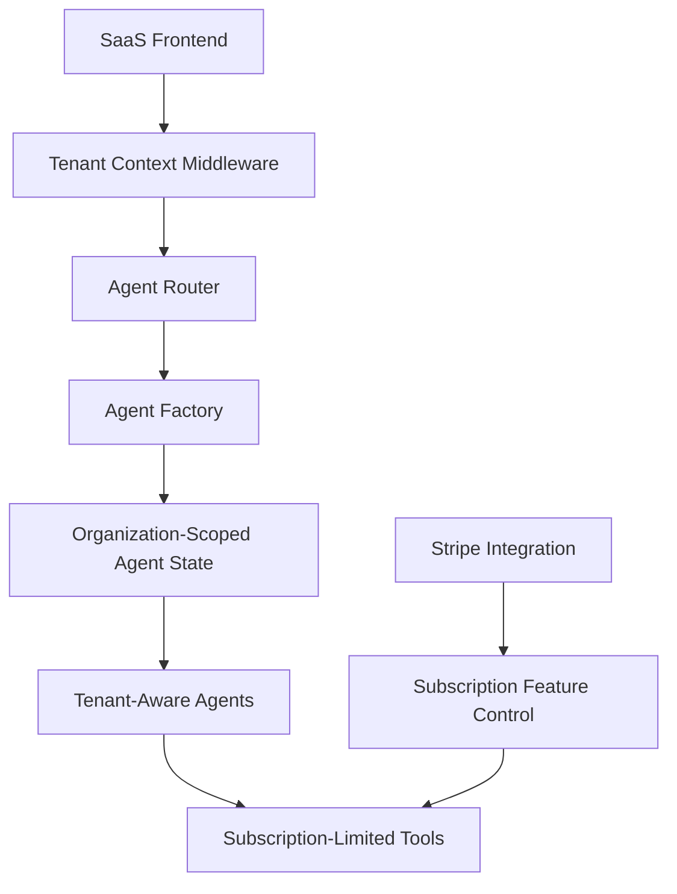

# AI Event Planner SaaS Agent Integration Plan

## Current System Architecture

1. **AI Agentic System:**
   - **Frontend Coordinator Agent**: Main interface with users, orchestrates other agents
   - **Specialized Agents**: Resource Planning, Financial, Stakeholder Management, Marketing & Communications, Project Management, Analytics, and Compliance & Security
   - Uses LangGraph for agent workflows and coordination
   - Implements agent communication via tools

2. **SaaS Transformation Progress:**
   - Multi-tenant database models defined in `models_saas.py`
   - Tenant middleware for request context
   - Subscription plans and billing infrastructure
   - Organization-based access control

## Integration Challenges

The main challenge is connecting the AI agentic system to the SaaS multi-tenant architecture, specifically:

1. Making agents tenant-aware
2. Enforcing subscription limits on agent functionality
3. Securing data isolation between tenants
4. Ensuring scalability across multiple tenants
5. Supporting tiered access to different agents based on subscription plans

## Proposed Integration Plan

Here's the proposed approach for connecting the AI agentic system to the SaaS application:

### 1. Agent State Isolation by Tenant

Create a tenant-aware state manager that:
- Stores agent states by organization ID
- Enforces data isolation between tenants
- Prevents cross-tenant data access

### 2. Subscription-Based Agent Access Control

Modify the agent system to:
- Check organization subscription level before agent activation
- Enable/disable specific agents based on subscription tier
- Enforce usage limits based on plan limits

### 3. Tenant-Aware Agent Tools

Update agent tools to:
- Include tenant context in all operations
- Apply organization-specific settings
- Filter results by tenant

### 4. Agent Factory with Multi-Tenant Support

Create an agent factory service that:
- Initializes agents with tenant context
- Attaches tenant-specific configurations
- Enforces tenant isolation patterns

### 5. Organization-Specific Configuration

Implement:
- Organization-level settings
- Custom agent configurations per tenant
- Organization-specific agent memory

### 6. Tiered Access to Agent Capabilities

Configure:
- Basic tier: Coordinator + Resource Planning agents only
- Professional tier: All core agents
- Enterprise tier: All agents + advanced features

## Technical Implementation Steps

1. **Create Tenant-Aware Agent Context:**
   - Modify agent state to include organization_id
   - Add tenant context to all agent operations

2. **Implement Agent Feature Controls:**
   - Create a feature flag system based on subscription plans
   - Build a service to check feature availability

3. **Update Agent Communication Tools:**
   - Ensure all inter-agent communications respect tenant boundaries
   - Add tenant context to all messages

4. **Tenant-Specific Resource Limitations:**
   - Implement usage tracking
   - Enforce limits based on subscription tier

5. **User and Role-Based Agent Access:**
   - Tie agent access to user roles within organizations
   - Implement permission checks in agent invocations

6. **Database Isolation:**
   - Ensure all agent operations filter by organization_id
   - Add tenant verification to data access patterns

## Implementation Timeline

This integration can be broken down into four major phases:

1. **Foundation Phase (2-3 weeks)**
   - Tenant-aware agent state management
   - Basic subscription checks
   - Database isolation implementation

2. **Core Integration Features (3-4 weeks)**
   - Complete agent factory implementation
   - Subscription-based access controls
   - Tenant-aware tools

3. **Tiered Access Implementation (2-3 weeks)**
   - Feature flag system
   - Agent capability tiers
   - Usage tracking and limits

4. **Testing & Optimization (2 weeks)**
   - Multi-tenant testing
   - Performance optimization
   - Security validation
