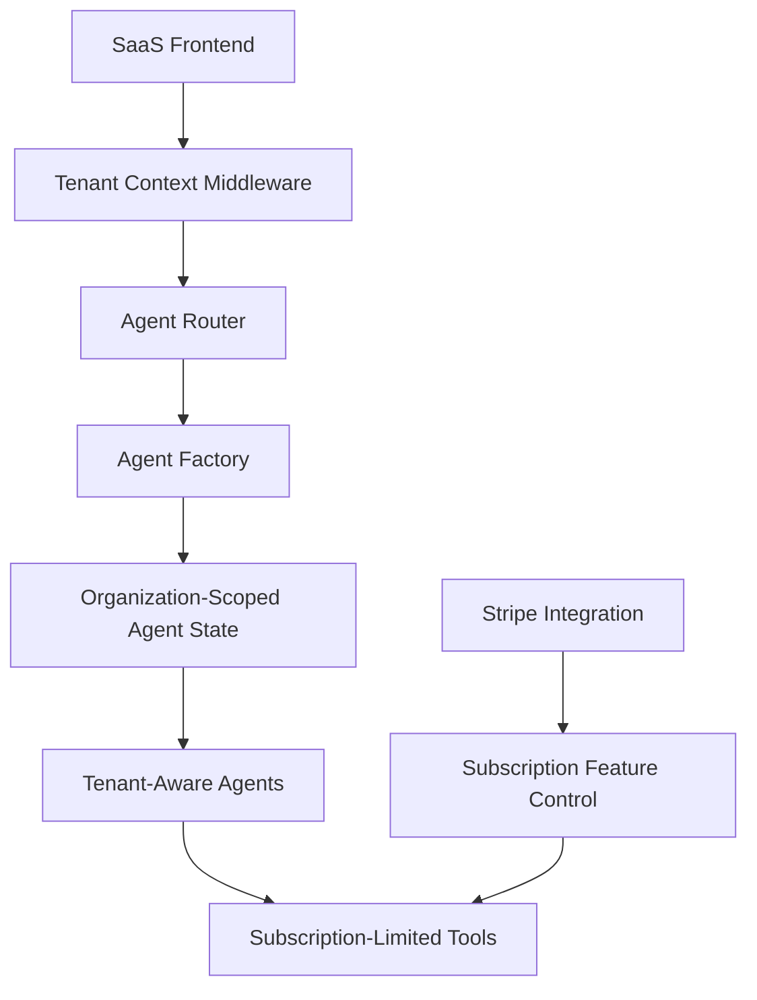
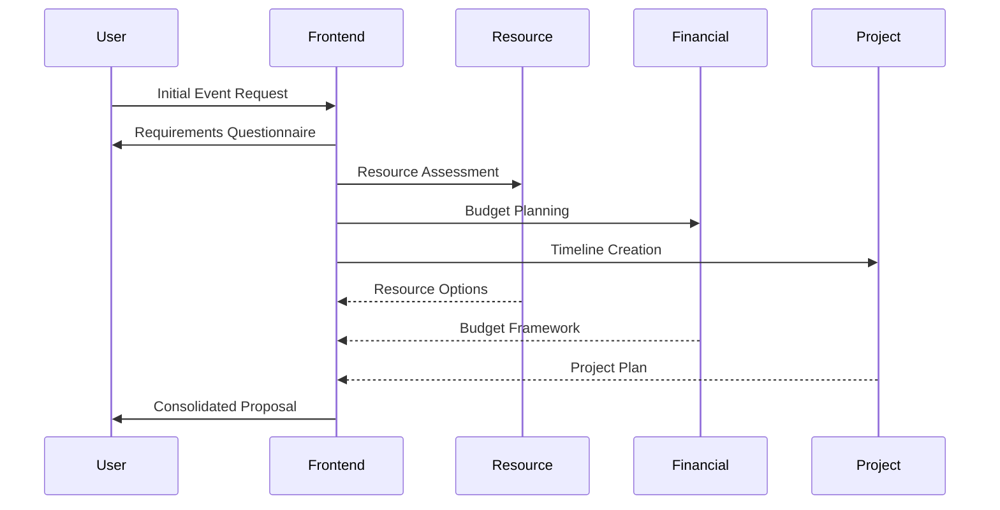

# AI Event Planner SaaS - Functional Specification and Marketing Document

## 1. Executive Summary

The AI Event Planner is a comprehensive SaaS platform that combines advanced AI agent technology with a multi-tenant architecture to deliver a powerful event planning solution. The system leverages a hierarchical agent structure with specialized AI agents that collaborate to handle all aspects of event planning, from initial concept to execution. The platform is designed to scale across multiple organizations with robust data isolation, subscription-based access controls, and enterprise-grade security.

## 2. System Architecture

### 2.1 Core Components

The AI Event Planner consists of two main components that work together seamlessly:

1. **AI Agentic System**:
   - A hierarchical structure of specialized AI agents
   - LangGraph-based workflows for agent coordination
   - State persistence for continuous conversations
   - Tool-based inter-agent communication

2. **SaaS Platform**:
   - Multi-tenant architecture with organization isolation
   - Subscription-based access controls
   - User management with role-based permissions
   - Event management with calendar integration
   - Analytics and reporting capabilities

### 2.2 Technical Stack

- **Backend**: FastAPI, SQLAlchemy, Alembic, Pydantic
- **Frontend**: HTML/CSS/JavaScript, Bootstrap
- **Database**: PostgreSQL with multi-tenant schema
- **AI Framework**: LangGraph, LangChain
- **Cloud Infrastructure**: Azure App Service, Azure Database for PostgreSQL
- **Authentication**: JWT-based authentication
- **Deployment**: Docker, GitHub Actions for CI/CD

### 2.3 Integration Architecture

## 3. AI Agent System

### 3.1 Agent Hierarchy

The AI Event Planner employs a hierarchical agent structure with a Frontend Coordinator Agent that orchestrates specialized agents:

1. **Frontend Coordinator Agent**:
   - Primary user interface
   - Systematic information collection
   - Task delegation to specialized agents
   - Progress monitoring and status updates

2. **Specialized Agents**:
   - **Resource Planning Agent**: Venue selection, service provider coordination, equipment allocation
   - **Financial Agent**: Budget management, payment processing, contract management
   - **Stakeholder Management Agent**: Sponsor engagement, speaker coordination, volunteer management
   - **Marketing & Communications Agent**: Campaign management, website creation, attendee communications
   - **Project Management Agent**: Task tracking, timeline management, risk assessment
   - **Analytics Agent**: Data collection, performance metrics, ROI analysis
   - **Compliance & Security Agent**: Legal requirements, security protocols, data protection

### 3.2 Agent Capabilities

#### 3.2.1 Frontend Coordinator Agent

- **Information Collection**: Systematically collects information in categories including:
  - Basic event details (type, title, description, attendee count, scale)
  - Timeline information (start/end dates, milestones, setup requirements)
  - Budget parameters (overall range, allocation priorities, payment timeline)
  - Location requirements (geographic preferences, venue type, capacity needs)
  - Stakeholder information (key stakeholders, speakers, sponsors, VIPs)
  - Resource requirements (equipment, staffing, service providers)
  - Success criteria (primary goals, KPIs, expected outcomes)
  - Risk assessment (potential challenges, contingency preferences)

- **Proposal Generation**: Creates comprehensive event proposals including:
  - Executive summary
  - Detailed event description
  - Timeline with milestones
  - Budget breakdown
  - Resource allocation plan
  - Stakeholder management approach
  - Risk management strategy
  - Success metrics
  - Next steps

- **Task Delegation**: Delegates specific tasks to specialized agents based on the approved proposal

#### 3.2.2 Resource Planning Agent

- Venue selection and management
- Service provider coordination
- Equipment and resource allocation
- Space optimization and layout planning

#### 3.2.3 Financial Agent

- Budget creation and management
- Cost estimation and tracking
- Payment scheduling and processing
- Contract management and negotiation

#### 3.2.4 Stakeholder Management Agent

- Stakeholder identification and analysis
- Communication planning and execution
- Sponsor management and ROI tracking
- Speaker and VIP coordination

#### 3.2.5 Marketing & Communications Agent

- Marketing strategy development
- Content creation for various channels
- Website and registration management
- Attendee communications and engagement

#### 3.2.6 Project Management Agent

- Task creation and assignment
- Timeline management and critical path analysis
- Risk identification and mitigation
- Progress tracking and reporting

#### 3.2.7 Analytics Agent

- Data collection planning
- Performance analysis and insights
- ROI calculation and reporting
- Recommendations for improvement

#### 3.2.8 Compliance & Security Agent

- Legal requirement identification
- Permit and license management
- Security planning and risk assessment
- Data protection and privacy compliance

### 3.3 Agent Interaction Workflow

## 4. SaaS Platform Features

### 4.1 Multi-Tenant Architecture

- **Organization Isolation**: Complete data isolation between different organizations
- **Tenant Context**: All operations include tenant context for proper data access
- **Shared Infrastructure**: Efficient resource utilization with shared infrastructure

### 4.2 Subscription Management

- **Tiered Plans**:
  - **Free Plan**: Basic features, limited events and users
  - **Professional Plan**: Advanced features, moderate limits
  - **Enterprise Plan**: All features, unlimited usage

- **Feature Access Control**:
  - Agent access based on subscription tier
  - Feature availability based on subscription tier
  - Usage limits based on subscription tier

- **Billing Integration**:
  - Stripe integration for payment processing
  - Monthly and annual billing options
  - Upgrade/downgrade capabilities

### 4.3 User Management

- **Team Management**:
  - User roles and permissions
  - Team member invitations
  - Role-based access control

- **Authentication**:
  - Secure JWT-based authentication
  - Password policies and management
  - Optional two-factor authentication

### 4.4 Event Management

- **Event Creation and Editing**:
  - Comprehensive event details
  - Event templates and duplication
  - Event status tracking

- **Calendar Integration**:
  - Visual calendar interface
  - iCalendar export
  - External calendar integration

- **Event Sharing**:
  - Collaboration with team members
  - Sharing with external stakeholders
  - Permission-based access

### 4.5 Agent Interaction

- **Agent Chat Interface**:
  - Intuitive chat-based interaction
  - Context-aware conversations
  - Message history and persistence

- **Event Context**:
  - Attach events to agent conversations
  - Agents access event details automatically
  - Context-aware recommendations

- **Feedback System**:
  - Rate agent responses
  - Provide detailed feedback
  - Continuous improvement

### 4.6 Analytics and Reporting

- **Usage Analytics**:
  - Conversation metrics
  - Agent utilization
  - User engagement

- **Performance Metrics**:
  - Agent effectiveness
  - Response quality
  - User satisfaction

- **Subscription Insights**:
  - Resource utilization
  - Limit tracking
  - Upgrade recommendations

## 5. Technical Implementation

### 5.1 Multi-Tenant Data Model

- **Organization-Based Isolation**:
  - Organization ID in all relevant tables
  - Tenant middleware for request context
  - Query filtering based on organization ID

- **Subscription Data**:
  - Subscription plans and features
  - Organization-specific limits
  - Usage tracking

### 5.2 Agent State Management

- **Tenant-Aware State Manager**:
  - In-memory storage for performance
  - Database persistence for durability
  - Organization-scoped state access

- **Conversation Persistence**:
  - Message history storage
  - Context preservation between sessions
  - Event attachment to conversations

### 5.3 Subscription-Based Access Control

- **Feature Control**:
  - Agent access based on subscription tier
  - Feature availability checks
  - Usage limit enforcement

- **Tiered Agent Access**:
  - Free tier: Coordinator and Resource Planning agents
  - Professional tier: Adds Financial, Stakeholder, Marketing, and Project Management agents
  - Enterprise tier: Adds Analytics and Compliance & Security agents

### 5.4 Frontend Implementation

- **Responsive Design**:
  - Mobile-friendly interface
  - Accessibility features
  - Consistent UI patterns

- **Agent UI**:
  - Chat-based interaction
  - Agent selection interface
  - Conversation history

- **Analytics Dashboard**:
  - Usage visualization
  - Performance metrics
  - Subscription utilization

### 5.5 Deployment Architecture

- **Azure App Service**:
  - Scalable web application hosting
  - Integrated with CI/CD pipeline
  - Monitoring and logging

- **Azure Database for PostgreSQL**:
  - Managed database service
  - Backup and recovery
  - Performance optimization

- **Azure Key Vault**:
  - Secure secret management
  - API key storage
  - Certificate management

## 6. Market Positioning

### 6.1 Target Audience

- **Primary Markets**:
  - Event planning agencies
  - Corporate event teams
  - Conference organizers
  - Wedding planners
  - Non-profit organizations

- **Secondary Markets**:
  - Educational institutions
  - Government agencies
  - Hospitality industry
  - Entertainment venues

### 6.2 Value Proposition

- **Efficiency**: Reduce event planning time by up to 70% through AI automation
- **Expertise**: Access specialized knowledge across all aspects of event planning
- **Collaboration**: Enable seamless teamwork with shared context and history
- **Scalability**: Handle multiple events simultaneously without additional staff
- **Consistency**: Ensure consistent quality and approach across all events

### 6.3 Competitive Advantages

- **AI-First Approach**: Purpose-built AI agents for event planning, not generic AI
- **Specialized Expertise**: Domain-specific knowledge in each agent
- **Comprehensive Solution**: End-to-end event planning in a single platform
- **Tiered Access**: Flexible pricing to accommodate different organization sizes
- **Multi-Tenant Architecture**: Enterprise-grade security and isolation

### 6.4 Pricing Strategy

- **Free Tier**:
  - Up to 5 events
  - Up to 2 users
  - Basic agents only
  - Limited features

- **Professional Tier** ($99/month):
  - Up to 20 events
  - Up to 10 users
  - Most agents and features
  - Standard support

- **Enterprise Tier** ($499/month):
  - Unlimited events
  - Unlimited users
  - All agents and features
  - Priority support
  - Custom integrations

## 7. Implementation Roadmap

### 7.1 Phase 1: Foundation (Completed)

- Core agent system implementation
- Basic SaaS infrastructure
- Multi-tenant database models
- Authentication system

### 7.2 Phase 2: Integration (Completed)

- Agent-SaaS integration
- Subscription management
- User and team management
- Event management

### 7.3 Phase 3: Enhancement (In Progress)

- Advanced analytics
- Additional agent capabilities
- Performance optimization
- Mobile responsiveness

### 7.4 Phase 4: Expansion (Planned)

- Additional integrations (CRM, marketing platforms)
- API for third-party extensions
- White-label options
- Enterprise SSO

## 8. Marketing Strategy

### 8.1 Key Messages

- "AI-powered event planning that works like a team of experts"
- "From concept to execution, all in one platform"
- "Scale your event planning business without scaling your team"
- "Enterprise-grade security with startup-friendly pricing"

### 8.2 Channel Strategy

- **Content Marketing**:
  - Blog posts on event planning best practices
  - Case studies and success stories
  - Webinars and educational content

- **Digital Marketing**:
  - SEO optimization for event planning keywords
  - Targeted social media campaigns
  - PPC advertising on relevant platforms

- **Partnership Marketing**:
  - Integrations with event technology providers
  - Co-marketing with venue networks
  - Industry association partnerships

### 8.3 Lead Generation

- **Free Trial Program**:
  - 14-day full-feature trial
  - Guided onboarding process
  - Sample events and templates

- **Demo Program**:
  - Personalized demos for enterprise prospects
  - Industry-specific use cases
  - ROI calculator

- **Referral Program**:
  - Customer referral incentives
  - Partner referral program
  - Affiliate marketing

## 9. Success Metrics

### 9.1 Business Metrics

- Monthly Recurring Revenue (MRR)
- Customer Acquisition Cost (CAC)
- Customer Lifetime Value (LTV)
- Churn Rate
- Conversion Rate (Free to Paid)

### 9.2 Product Metrics

- Daily Active Users (DAU)
- Events Created per Organization
- Agent Conversations per Event
- User Satisfaction Score
- Feature Adoption Rate

### 9.3 Technical Metrics

- System Uptime
- Response Time
- Error Rate
- Database Performance
- API Reliability

## 10. Conclusion

The AI Event Planner SaaS platform represents a significant advancement in event planning technology, combining the power of specialized AI agents with a robust multi-tenant SaaS architecture. By automating and enhancing the event planning process, the platform enables organizations of all sizes to plan and execute successful events with greater efficiency, consistency, and expertise.

With its tiered subscription model, the platform is accessible to a wide range of organizations, from small event planning businesses to large enterprise teams. The comprehensive feature set, specialized agent capabilities, and seamless integration make it a compelling solution for the event planning industry.

As the platform continues to evolve with additional features, integrations, and optimizations, it is well-positioned to become the leading AI-powered event planning solution in the market.
