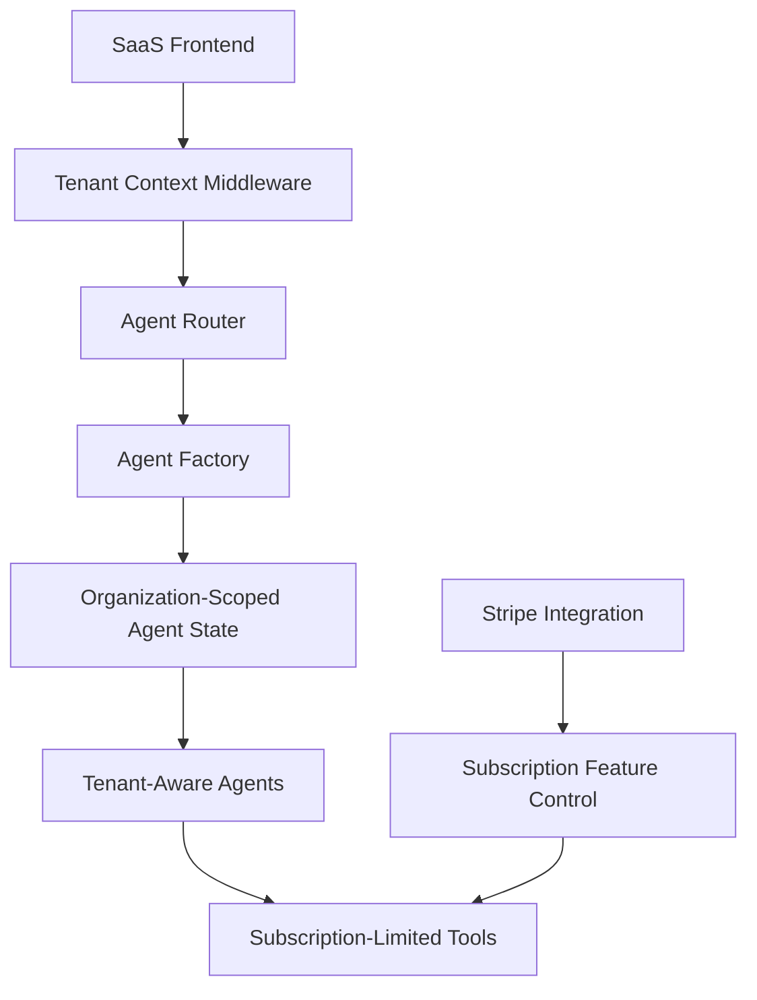

# AI Event Planner SaaS Agent Integration

This document describes the integration of the AI agentic system with the SaaS multi-tenant architecture.

## Overview

The AI Event Planner SaaS platform integrates a sophisticated AI agentic system with a multi-tenant SaaS architecture. This integration enables:

1. **Tenant-Aware Agents**: All agents operate within the context of a specific organization/tenant
2. **Subscription-Based Access**: Agent capabilities are tied to subscription tiers
3. **Data Isolation**: Complete isolation of agent data between tenants
4. **Scalable Architecture**: Support for multiple organizations with varying needs

## Architecture

The integration follows this architecture:



## Key Components

### 1. Tenant-Aware State Manager

The `TenantAwareStateManager` extends the base state manager to include organization context, ensuring proper data isolation between tenants. It:

- Stores agent states by organization ID
- Enforces data isolation between tenants
- Prevents cross-tenant data access

### 2. Subscription Feature Control

The `SubscriptionFeatureControl` service checks if an organization has access to specific agent features based on their subscription plan:

- Free tier: Access to Coordinator and Resource Planning agents only
- Professional tier: Access to most agents (excluding Analytics and Compliance)
- Enterprise tier: Access to all agents and features

### 3. Agent Factory

The `AgentFactory` creates agents with tenant context and subscription-based access controls:

- Initializes agents with tenant context
- Checks subscription tier before creating agents
- Enforces tenant isolation patterns

### 4. Agent Router

The `AgentRouter` handles agent requests and ensures tenant context is properly passed:

- Routes requests to the appropriate agent
- Enforces tenant isolation
- Handles subscription-based access control errors

### 5. API Router

The `APIRouter` exposes agent endpoints with tenant context:

- `/api/agents/message`: Send a message to an agent
- `/api/agents/conversations/{conversation_id}`: Get conversation history
- `/api/agents/conversations`: List conversations
- `/api/agents/conversations/{conversation_id}`: Delete a conversation

## Subscription Tiers

| Feature | Free Tier | Professional Tier | Enterprise Tier |
|---------|-----------|-------------------|-----------------|
| **Agents** | Coordinator, Resource Planning | Coordinator, Resource Planning, Financial, Stakeholder Management, Marketing & Communications, Project Management | All agents (including Analytics and Compliance & Security) |
| **Events** | 5 | 20 | Unlimited |
| **Users** | 2 | 10 | Unlimited |
| **Advanced Recommendations** | ❌ | ✅ | ✅ |
| **Custom Templates** | ❌ | ✅ | ✅ |
| **Analytics Dashboard** | ❌ | ✅ | ✅ |
| **Priority Support** | ❌ | ❌ | ✅ |

## Getting Started

### Running the SaaS Application with Agent Integration

1. Set up your environment variables in `.env.saas`
2. Run the application:

```bash
python run_saas_with_agents.py
```

### Testing the Integration

To test the integration between the SaaS platform and the agent system:

```bash
python test_saas_agent_integration.py
```

This script tests:
- Tenant isolation
- Subscription-based access controls
- Agent state management with tenant context

## API Usage Examples

### Sending a Message to an Agent

```python
import requests

# Set tenant context
headers = {
    "Authorization": f"Bearer {token}",
    "X-Tenant-ID": "1"  # Organization ID
}

# Send message to agent
response = requests.post(
    "http://localhost:8000/api/agents/message",
    headers=headers,
    json={
        "agent_type": "coordinator",
        "message": "I need help planning a conference for 500 people"
    }
)

# Get response
result = response.json()
print(result["response"])
```

### Getting Conversation History

```python
import requests

# Set tenant context
headers = {
    "Authorization": f"Bearer {token}",
    "X-Tenant-ID": "1"  # Organization ID
}

# Get conversation history
response = requests.get(
    f"http://localhost:8000/api/agents/conversations/{conversation_id}",
    headers=headers
)

# Get messages
result = response.json()
for message in result["messages"]:
    print(f"{message['role']}: {message['content']}")
```

## Implementation Details

### Tenant Context Middleware

The tenant middleware extracts the tenant ID from:
1. HTTP header (`X-Tenant-ID`)
2. Subdomain
3. Path parameter

This tenant ID is then used to scope all agent operations.

### Subscription-Based Access Control

When a user attempts to access an agent, the system:
1. Checks the organization's subscription plan
2. Verifies if the agent is available in that plan
3. Allows or denies access accordingly

### Data Isolation

All agent states are stored with organization context, ensuring:
1. Organizations can only access their own conversations
2. Agent responses are tailored to the organization's context
3. Complete isolation between tenants

## Security Considerations

- All agent endpoints require authentication
- Tenant verification is performed on every request
- Cross-tenant access attempts are blocked
- Subscription checks are enforced on all agent operations
