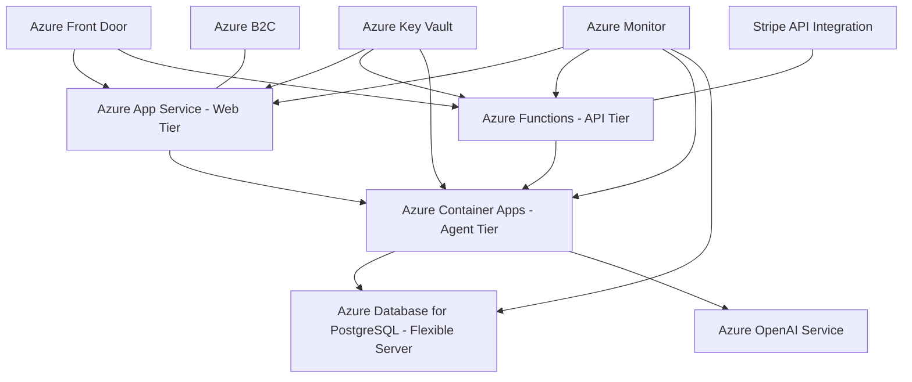

# AI Event Planner SaaS Transformation Plan

## 1. SaaS Architecture Transformation

### Current Architecture
- FastAPI backend with specialized AI agents using LangGraph
- SQLite database (in development) with PostgreSQL in production
- Basic user authentication
- Single-tenant design (one user = one instance)

### Proposed SaaS Architecture


## 2. Multi-tenancy Implementation

1. **Database Schema Updates**:
   - Add Organization/Tenant tables
   - Modify existing tables to include tenant_id
   - Implement row-level security in PostgreSQL

2. **Tenant Isolation**:
   - Implement tenant context middleware
   - Add tenant identification in all API routes
   - Ensure data isolation between tenants

## 3. Identity & Access Management

1. **Azure AD B2C Integration**:
   - Replace current JWT authentication with Azure AD B2C
   - Implement tiered permission model (Admin, Manager, User)
   - Enable single sign-on capabilities

2. **Role-Based Access Control**:
   - Implement RBAC throughout the application
   - Create organization admin dashboard
   - Add user management features

## 4. Subscription & Billing Integration

1. **Tier Structure**:
   - Free tier (limited events, basic features)
   - Professional tier (more events, all agents, premium features)
   - Enterprise tier (custom limits, dedicated resources, premium support)

2. **Stripe Integration**:
   - Implement payment processing
   - Add subscription management
   - Handle billing cycles and invoicing

## 5. Front-end Enhancements

1. **Multi-tenant UI**:
   - Organization-level dashboard
   - User management interface
   - Subscription management portal

2. **Modern SaaS Features**:
   - Onboarding workflow
   - Feature discovery and tutorials
   - Notification system

## 6. Azure DevOps & Infrastructure

1. **CI/CD Pipeline Enhancement**:
   - Multi-environment deployment (Dev, Test, Staging, Prod)
   - Blue-green deployment strategy
   - Automated testing

2. **Azure Resource Optimization**:
   - Implement auto-scaling
   - Set up geographic replication for global reach
   - Configure high availability

## 7. Monitoring & Analytics

1. **Azure Application Insights**:
   - Comprehensive application monitoring
   - User activity tracking
   - Performance metrics

2. **SaaS-specific Metrics**:
   - Customer acquisition metrics
   - Churn analysis
   - Feature usage tracking

## 8. Compliance & Security

1. **Data Protection**:
   - Enhance encryption mechanisms
   - Implement data residency features
   - Add GDPR compliance tools

2. **Security Enhancements**:
   - Enable Azure DDoS protection
   - Implement Web Application Firewall
   - Add regular security scanning

## Implementation Timeline

This conversion can be broken down into four major phases:

1. **Foundation Phase (2-3 weeks)**
   - Database schema updates for multi-tenancy
   - Azure AD B2C integration
   - Basic subscription management

2. **Core SaaS Features (3-4 weeks)**
   - Complete subscription/billing system
   - Multi-tenant UI development
   - RBAC implementation

3. **Azure Optimization (2-3 weeks)**
   - Scaling and high availability setup
   - Geographic distribution
   - Enhanced monitoring

4. **Polishing & Launch (2 weeks)**
   - Final UI/UX improvements
   - Comprehensive testing
   - Documentation and training materials

## Technical Implementation Details

### Multi-tenancy Implementation

The multi-tenancy model will follow a database-per-tenant approach with the following components:

1. **Tenant Management Service**:
   - Handles tenant provisioning and configuration
   - Manages tenant metadata and settings
   - Controls tenant lifecycle (creation, suspension, deletion)

2. **Database Schema Changes**:
   ```sql
   -- New tables
   CREATE TABLE organizations (
       id SERIAL PRIMARY KEY,
       name VARCHAR(255) NOT NULL,
       slug VARCHAR(50) UNIQUE NOT NULL,
       plan_id VARCHAR(50) NOT NULL,
       created_at TIMESTAMP NOT NULL DEFAULT NOW(),
       updated_at TIMESTAMP NOT NULL DEFAULT NOW()
   );

   CREATE TABLE organization_users (
       organization_id INTEGER REFERENCES organizations(id),
       user_id INTEGER REFERENCES users(id),
       role VARCHAR(50) NOT NULL,
       PRIMARY KEY (organization_id, user_id)
   );

   -- Modify existing tables
   ALTER TABLE conversations ADD COLUMN organization_id INTEGER REFERENCES organizations(id);
   ALTER TABLE events ADD COLUMN organization_id INTEGER REFERENCES organizations(id);
   ```

3. **Tenant Context Middleware**:
   ```python
   @app.middleware("http")
   async def tenant_middleware(request: Request, call_next):
       # Extract tenant identifier from request (header, subdomain, path)
       tenant_id = extract_tenant_id(request)
       
       # Set tenant context for this request
       request.state.tenant_id = tenant_id
       
       # Continue with request
       response = await call_next(request)
       return response
   ```

### Azure OpenAI Service Integration

To leverage Azure's managed AI services:

1. **LLM Factory Modification**:
   ```python
   def get_llm(provider="azure_openai"):
       if provider == "azure_openai":
           return AzureChatOpenAI(
               azure_deployment=os.getenv("AZURE_OPENAI_DEPLOYMENT"),
               openai_api_version=os.getenv("AZURE_OPENAI_API_VERSION"),
               azure_endpoint=os.getenv("AZURE_OPENAI_ENDPOINT"),
               azure_ad_token_provider=get_azure_ad_token
           )
       # Fallback to other providers
   ```

2. **Azure OpenAI Configuration**:
   ```
   AZURE_OPENAI_DEPLOYMENT=gpt-4
   AZURE_OPENAI_API_VERSION=2023-05-15
   AZURE_OPENAI_ENDPOINT=https://<your-resource-name>.openai.azure.com/
   ```

### Subscription Management

1. **Stripe Integration**:
   ```python
   @router.post("/create-subscription")
   async def create_subscription(
       plan_id: str,
       current_user: User = Depends(get_current_user),
       db: Session = Depends(get_db)
   ):
       # Create Stripe customer if not exists
       if not current_user.stripe_customer_id:
           customer = stripe.Customer.create(
               email=current_user.email,
               name=current_user.name
           )
           current_user.stripe_customer_id = customer.id
           db.commit()
       
       # Create subscription
       subscription = stripe.Subscription.create(
           customer=current_user.stripe_customer_id,
           items=[{"price": plan_id}],
           payment_behavior="default_incomplete",
           expand=["latest_invoice.payment_intent"]
       )
       
       return {
           "subscriptionId": subscription.id,
           "clientSecret": subscription.latest_invoice.payment_intent.client_secret
       }
   ```

2. **Subscription Webhook Handler**:
   ```python
   @router.post("/webhook/stripe")
   async def stripe_webhook(request: Request, db: Session = Depends(get_db)):
       payload = await request.body()
       sig_header = request.headers.get("stripe-signature")
       
       try:
           event = stripe.Webhook.construct_event(
               payload, sig_header, os.getenv("STRIPE_WEBHOOK_SECRET")
           )
       except ValueError:
           raise HTTPException(status_code=400, detail="Invalid payload")
       except stripe.error.SignatureVerificationError:
           raise HTTPException(status_code=400, detail="Invalid signature")
       
       # Handle subscription events
       if event.type == "customer.subscription.created":
           handle_subscription_created(event.data.object, db)
       elif event.type == "customer.subscription.updated":
           handle_subscription_updated(event.data.object, db)
       elif event.type == "customer.subscription.deleted":
           handle_subscription_deleted(event.data.object, db)
       
       return {"status": "success"}
