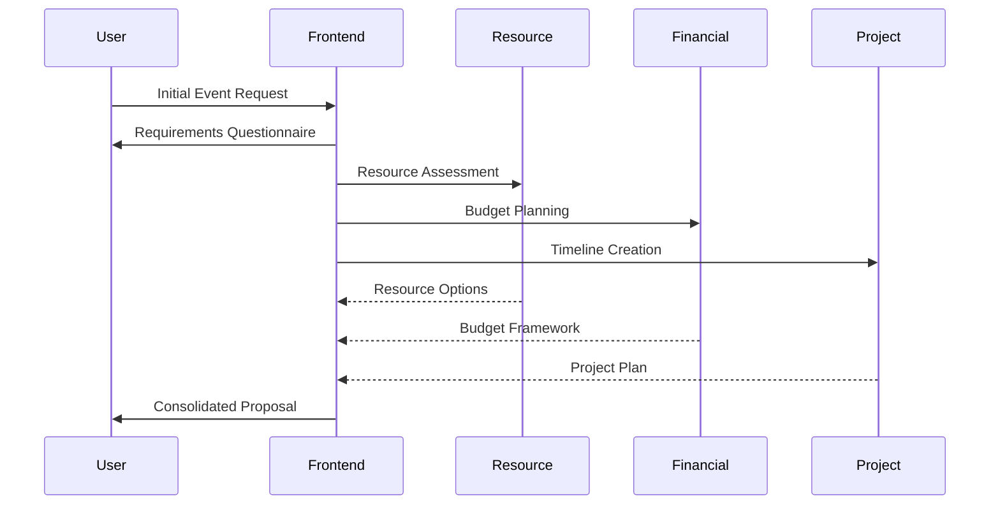

# Event Planning Agentic System Design

## 1. System Overview

The system follows a hierarchical agent structure with a Frontend Coordinator Agent interfacing with users and orchestrating specialized agents for different aspects of event planning.

### 1.1 Core Agent Types

1. **Frontend Coordinator Agent**
   - Primary user interface
   - Initial requirements gathering
   - Task delegation to specialized agents
   - Progress monitoring and status updates
   - Goal: Ensure cohesive event planning experience

2. **Resource Planning Agent**
   - Venue selection and management
   - Service provider coordination
   - Equipment and resource allocation
   - Goal: Optimize resource utilization

3. **Financial Agent**
   - Budget management
   - Payment processing
   - Contract management
   - Goal: Ensure financial compliance and efficiency

4. **Stakeholder Management Agent**
   - Sponsor engagement
   - Speaker coordination
   - Volunteer management
   - Goal: Maintain stakeholder relationships

5. **Marketing & Communications Agent**
   - Campaign management
   - Website creation
   - Attendee communications
   - Goal: Drive event awareness and attendance

6. **Project Management Agent**
   - Task tracking
   - Timeline management
   - Risk assessment
   - Goal: Ensure timely event delivery

7. **Analytics Agent**
   - Data collection
   - Performance metrics
   - ROI analysis
   - Goal: Provide actionable insights

8. **Compliance & Security Agent**
   - Legal requirements
   - Security protocols
   - Data protection
   - Goal: Ensure regulatory compliance

## 2. Agent Interactions

### 2.1 Frontend Coordinator Agent Workflow



### 2.2 Inter-Agent Communication Patterns

1. **Request-Response**
   - Synchronous information exchange
   - Direct agent-to-agent queries
   - Status updates

2. **Publish-Subscribe**
   - Event notifications
   - Status changes
   - Timeline updates

3. **Broadcast**
   - System-wide announcements
   - Critical updates
   - Emergency notifications

## 3. Agent Responsibilities

### 3.1 Frontend Coordinator Agent

- **Initial Assessment**
  * Event type determination
  * Scale and complexity evaluation
  * Budget range identification
  * Timeline constraints

- **Requirement Analysis**
  * Stakeholder identification
  * Resource needs assessment
  * Risk evaluation
  * Success criteria definition

- **Coordination**
  * Agent task delegation
  * Progress monitoring
  * Conflict resolution
  * Status reporting

### 3.2 Resource Planning Agent

- **Venue Management**
  * Venue search and selection
  * Capacity planning
  * Layout optimization
  * Technical requirements

- **Service Provider Coordination**
  * Provider search and vetting
  * Proposal management
  * Contract negotiation
  * Performance monitoring

- **Resource Allocation**
  * Equipment tracking
  * Staff assignment
  * Schedule optimization
  * Contingency planning

### 3.3 Financial Agent

- **Budget Management**
  * Cost estimation
  * Budget allocation
  * Expense tracking
  * Financial reporting

- **Payment Processing**
  * Invoice management
  * Payment scheduling
  * Refund handling
  * Dispute resolution

- **Contract Management**
  * Contract generation
  * Term negotiation
  * Signature collection
  * Compliance verification

### 3.4 Stakeholder Management Agent

- **Sponsor Management**
  * Sponsor acquisition
  * Benefit fulfillment
  * ROI tracking
  * Relationship maintenance

- **Speaker Coordination**
  * Speaker selection
  * Schedule management
  * Content review
  * Support coordination

- **Volunteer Management**
  * Role definition
  * Recruitment
  * Training coordination
  * Schedule management

### 3.5 Marketing & Communications Agent

- **Campaign Management**
  * Strategy development
  * Channel selection
  * Content creation
  * Performance tracking

- **Website Management**
  * Site creation
  * Content updates
  * Registration integration
  * Analytics tracking

- **Attendee Communications**
  * Registration confirmation
  * Event updates
  * Reminder scheduling
  * Feedback collection

### 3.6 Project Management Agent

- **Task Management**
  * Task creation
  * Assignment
  * Progress tracking
  * Dependency management

- **Timeline Control**
  * Milestone setting
  * Critical path analysis
  * Delay mitigation
  * Schedule optimization

- **Risk Management**
  * Risk identification
  * Mitigation planning
  * Issue tracking
  * Contingency activation

### 3.7 Analytics Agent

- **Data Collection**
  * Metric definition
  * Data gathering
  * Quality verification
  * Storage management

- **Analysis**
  * Pattern recognition
  * Trend analysis
  * Prediction modeling
  * Recommendation generation

- **Reporting**
  * Dashboard creation
  * Alert generation
  * Report scheduling
  * Insight delivery

### 3.8 Compliance & Security Agent

- **Legal Compliance**
  * Requirement tracking
  * Documentation review
  * Audit support
  * Update monitoring

- **Security Management**
  * Access control
  * Data protection
  * Threat monitoring
  * Incident response

## 4. Agent Decision Making

### 4.1 Frontend Coordinator Agent

```python
def assess_event_requirements(event_details):
    required_agents = []
    
    if event_details.budget > THRESHOLD_LARGE:
        required_agents.extend([
            FinancialAgent(role="primary"),
            ComplianceAgent(role="oversight")
        ])
    
    if event_details.attendees > THRESHOLD_COMPLEX:
        required_agents.extend([
            ResourceAgent(role="venue"),
            StakeholderAgent(role="coordination")
        ])
    
    if event_details.virtual_component:
        required_agents.append(TechnicalAgent(role="streaming"))
    
    return create_agent_network(required_agents)
```

### 4.2 Resource Planning Agent

```python
def optimize_resource_allocation(resources, requirements):
    allocation_plan = {
        'venues': prioritize_venues(requirements),
        'providers': match_providers(requirements),
        'equipment': allocate_equipment(requirements)
    }
    
    conflicts = detect_conflicts(allocation_plan)
    if conflicts:
        return resolve_conflicts(conflicts, allocation_plan)
    
    return allocation_plan
```

## 5. Implementation Guidelines

### 5.1 Agent Framework Requirements

- Asynchronous communication support
- State management capabilities
- Decision-making logic
- Learning capabilities
- Error handling
- Monitoring and logging

### 5.2 Integration Points

- User interface layer
- External service providers
- Payment gateways
- Communication channels
- Analytics platforms
- Security systems

### 5.3 Scalability Considerations

- Dynamic agent instantiation
- Load balancing
- Resource optimization
- Performance monitoring
- Failure recovery

## 6. Success Metrics

### 6.1 System Performance

- Response time
- Decision accuracy
- Resource utilization
- Error rates
- User satisfaction

### 6.2 Event Success

- Budget adherence
- Timeline compliance
- Stakeholder satisfaction
- Attendee feedback
- ROI metrics

## 7. Future Enhancements

### 7.1 AI Capabilities

- Machine learning for decision optimization
- Natural language processing for communication
- Predictive analytics for risk management
- Automated resource optimization
- Pattern recognition for trend analysis

### 7.2 Integration Opportunities

- Virtual reality event planning
- Blockchain for contracts and payments
- IoT for resource tracking
- AI-powered attendee matching
- Automated vendor negotiations
